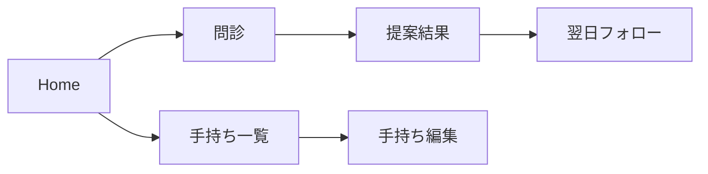

# Design (0001 Initial Implementation)

## 1. 実装アプローチ
- FlutterでiOS/Android共通のPoCを構築する
- ルールベースで安全に動作させ、回答は固定フォーマットで出力する
- 端末内保存のみで完結させる（外部APIなし）

## 2. 変更するコンポーネント
### 2.1 画面（Features）
- ホーム（問診開始/手持ち管理）
- 問診（症状＋強度）
- 手持ち登録/編集
- 提案結果（今夜の指示）
- 翌日フォロー
- 注意事項

### 2.2 ロジック（Domain）
- 症状×強度 → 方針タグの判定
- 方針タグ → 使用/休止カテゴリの選定
- 出力テンプレートの整形

### 2.3 永続化（Data）
- Product/Consultation/Recommendation/FollowUp の保存
- 端末内ストレージ（Hive/SQLiteいずれか）

## 3. データ構造の影響
- PoC用の最小エンティティを追加
  - Product（手持ち）
  - Consultation（問診）
  - Recommendation（今夜の指示）
  - FollowUp（翌日結果）
- すべて匿名・端末内のみ

## 4. 画面フロー（簡易）

## 5. 影響範囲の分析
- 永続的ドキュメントの更新対象
  - `docs/functional-design.md`（機能設計）
  - `docs/architecture.md`（技術仕様）
  - `docs/repository-structure.md`（構成）
  - `docs/development-guidelines.md`（開発規約）
  - `docs/glossary.md`（用語）
- 今回はPoC範囲に限定して実装するため、既存コードへの影響はなし

## 6. リスクと回避策
- 回答が医療的に見えるリスク → 固定フォーマット＋注意書き＋受診誘導
- ユーザー入力負担 → 商品名＋カテゴリに限定
- 安全性 → ルールベースで運用し自由回答を避ける
