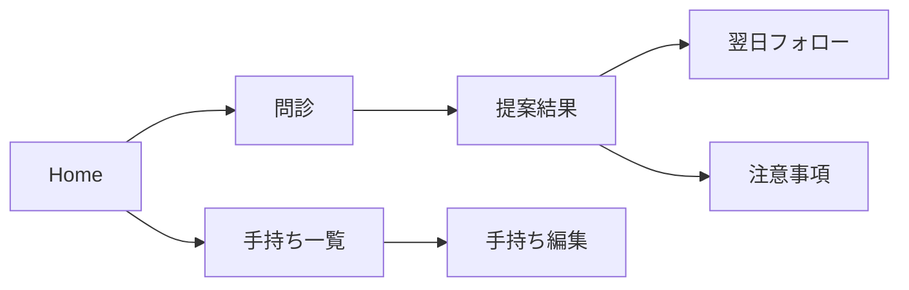

# Design (0001 Initial Implementation)

## 1. 実装アプローチ
- FlutterでiOS/Android共通のPoCを構築する
- ルールベースで安全に動作させ、回答は固定フォーマットで出力する
- 端末内保存のみで完結させる（外部APIなし）
- ストレージはPoC速度重視でHiveを第一候補とする（未確定）

## 2. 変更するコンポーネント
### 2.1 画面（Features）
- ホーム（問診開始/手持ち管理）
- 問診（症状＋強度）
- 手持ち登録/編集
- 提案結果（今夜の指示）
- 翌日フォロー
- 注意事項

### 2.2 ロジック（Domain）
- 症状×強度 → 方針タグの判定
- 方針タグ → 使用/休止カテゴリの選定
- 出力テンプレートの整形

### 2.3 永続化（Data）
- Product/Consultation/Recommendation/FollowUp の保存
- 端末内ストレージ（Hive/SQLiteいずれか）

## 3. データ構造
PoC用の最小エンティティを追加し、すべて匿名・端末内のみで保持する。

### 3.1 Product（手持ち）
- id: string
- name: string
- category: string
- isActive: bool
- createdAt: datetime

### 3.2 Consultation（問診）
- id: string
- symptom: string
- severity: string
- createdAt: datetime

### 3.3 Recommendation（今夜の指示）
- id: string
- consultationId: string
- policyTags: string[]
- useCategories: string[]
- restCategories: string[]
- steps: string[]
- watchouts: string[]
- createdAt: datetime

### 3.4 FollowUp（翌日結果）
- id: string
- recommendationId: string
- result: string
- memo: string?
- createdAt: datetime

## 4. ルールエンジン仕様（簡易）
### 4.1 症状・強度
- symptom: `redness` / `itch` / `dryness` / `sting` / `oily` / `other`
- severity: `mild` / `moderate` / `severe`

### 4.2 方針タグ
- `barrier_low`（刺激に弱い）
- `inflammation`（炎症寄り）
- `dry_bias`（乾燥寄り）
- `oily_bias`（皮脂寄り）

### 4.3 症状×強度の判定ルール（例）
- `sting` または `redness` かつ `severe` → `barrier_low` + `inflammation`
- `dryness` かつ `moderate` 以上 → `dry_bias`
- `oily` かつ `moderate` 以上 → `oily_bias`
- `itch` かつ `severe` → `inflammation`

### 4.4 使用/休止カテゴリの決定
- `barrier_low` → 休止: `exfoliant` `retinoid` `strong_acid`
- `inflammation` → 休止: `fragrance` `alcohol` / 使用: `soothing` `barrier`
- `dry_bias` → 使用: `hydrating` `occlusive`
- `oily_bias` → 使用: `light_gel` / 休止: `heavy_oil`

### 4.5 出力テンプレート
固定フォーマットで表示する。
- 使う: カテゴリ + 該当する手持ち商品名
- 休む: カテゴリ + 該当する手持ち商品名
- 手順: 2〜4ステップの短い指示
- 様子見ルール: 「悪化/痛み/腫れ」の場合は中止 + 受診誘導

## 5. 画面フロー（簡易）

## 6. 画面詳細（最低限）
- ホーム: 問診開始/手持ち管理への導線のみ
- 問診: 症状選択 + 強度選択（2画面以内）
- 手持ち: 商品名 + カテゴリの追加/編集/無効化
- 提案結果: 固定フォーマット出力、注意事項へのリンク
- 翌日フォロー: 3択 + 任意メモ
- 注意事項: 医療行為ではない旨、危険サインの説明

## 7. 影響範囲の分析
- 永続的ドキュメントの更新対象
  - `docs/functional-design.md`（機能設計）
  - `docs/architecture.md`（技術仕様）
  - `docs/repository-structure.md`（構成）
  - `docs/development-guidelines.md`（開発規約）
  - `docs/glossary.md`（用語）
- 今回はPoC範囲に限定して実装するため、既存コードへの影響はなし

## 8. リスクと回避策
- 回答が医療的に見えるリスク → 固定フォーマット＋注意書き＋受診誘導
- ユーザー入力負担 → 商品名＋カテゴリに限定
- 安全性 → ルールベースで運用し自由回答を避ける
 - 端末内のみ保存 → 端末変更/削除でデータ消失
