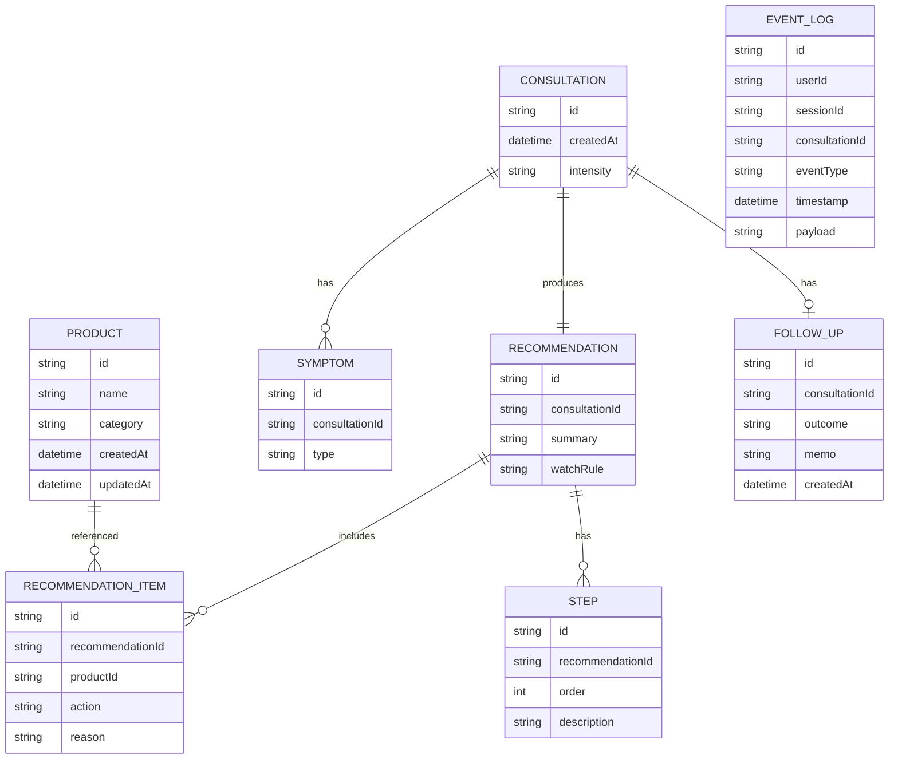

# Functional Design (PoC)

## 1. 概要
PoCとして「肌荒れが気になる夜に、家にあるものだけで最短のケア指示を返す」体験を、iPhoneアプリの最小構成で実現する。

## 2. スコープ（PoC）
### 対象
- 30秒問診
- 手持ちコスメ登録（商品名＋カテゴリ）
- 今夜の指示（使う/休む/手順/様子見ルール）
- 翌日フォロー（3択＋任意メモ）
- 医療行為ではない注意事項と受診誘導
- KPI一覧（端末内の簡易集計）

### 対象外
- 成分解析・相性チェック
- 購入レコメンド/EC連携
- 医療判断や診断に見える表現

## 3. 機能ごとのアーキテクチャ
### 3.1 問診
- 症状（複数選択）＋強度（単一選択）
- 入力は端末内で保持、外部送信なし

### 3.2 手持ちコスメ登録
- 商品名とカテゴリの最小情報のみ
- 参照しやすい一覧・編集が可能

### 3.3 提案生成（ルール+テンプレート）
- 症状と強度から「今夜の方針」を決定
- ユーザーが選んだ手持ちから最大2〜3個を選定
- 「休むもの」は理由付きで表示
- 出力は固定フォーマットで安全性を確保

### 3.4 翌日フォロー
- 良くなった/変わらない/悪化の3択
- 任意メモは端末内保存のみ

### 3.5 注意事項表示
- 医療行為ではない旨の明記
- 危険サイン（強い痛み/広範な腫れ/発熱/化膿等）は受診誘導

### 3.6 KPI一覧（PoC運用）
- EventLogを端末内で集計し、KPI一覧を最小構成で表示
- 直近14日をデフォルト期間とする

## 4. システム構成図
PoCはiOS端末内のみで完結する。


## 5. データモデル定義（ER図）
匿名・端末内保存のみ。



## 6. コンポーネント設計
- UI Layer
  - 問診画面
  - 手持ち一覧/編集
  - 提案結果
  - 翌日フォロー
  - 注意事項
  - KPI一覧（PoC運用）
- Decision Engine
  - ルール判定（症状×強度）
  - 手持ち選定ロジック（最大2〜3件）
  - 出力テンプレート整形
- Local Storage
  - Product/Consultation/Recommendation/FollowUpの保存
  - EventLogの保存

## 7. ユースケース


## 8. 画面遷移図


## 9. ワイヤーフレーム（ASCII）
### ホーム
```
--------------------------------
  今夜の肌荒れケア
  [ 問診を始める ]
  [ 手持ちを管理 ]
--------------------------------
```

### 問診
```
--------------------------------
  気になる症状（複数選択）
  [ ] 赤み  [ ] ヒリつき
  [ ] 乾燥  [ ] ニキビっぽい
  [ ] かゆみ

  強さ:  (弱) (中) (強)

  [ 次へ ]
--------------------------------
```

### 提案結果
```
--------------------------------
  今夜の指示
  使う: 2〜3個
  休む: 1〜2個（理由）

  手順:
  1) ...
  2) ...

  明日どうなったら変更するか:
  ...

  [ 翌日フォローへ ]
--------------------------------
```

### KPI一覧（PoC運用）
```
--------------------------------
  KPI一覧（直近14日）
  問診完了率 62%（31/50）
  提案到達率 80%（40/50）
  提案実行率 52%（26/50）
  2回目利用率 30%（6/20）
  不安低減 4.1 / 5
  紹介意向 7.2 / 10
--------------------------------
```

## 10. API設計（PoC）
外部APIは使用しない。端末内のサービスインターフェースのみ定義する。

### Internal Interfaces（例）
- `saveProduct(name, category) -> Product`
- `startConsultation(symptoms[], intensity) -> Consultation`
- `generateRecommendation(consultationId, productIds[]) -> Recommendation`
- `saveFollowUp(consultationId, outcome, memo) -> FollowUp`
- `logEvent(event) -> void`
- `getKpiSummary(period) -> KpiSummary`

## 11. ルール設計の方針（PoC）
- 症状×強度に応じて「方針タグ」を付与
  - 例: 刺激回避/保湿優先/洗浄最小化
- 方針タグに合うカテゴリを優先
- 使うのは最大2〜3個に制限
- 休む理由は短文テンプレで固定

## 12. 制約と注意事項
- 医療的診断に見える表現は避ける
- 危険サインは受診誘導を明確に表示
- データは匿名・端末内のみ
